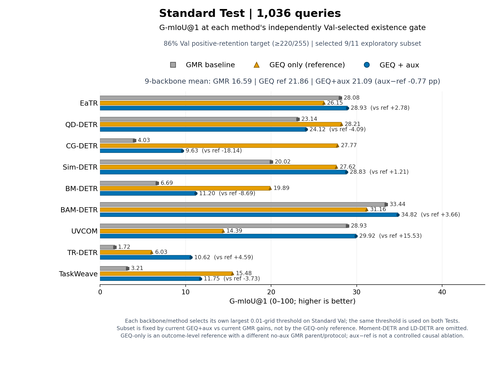
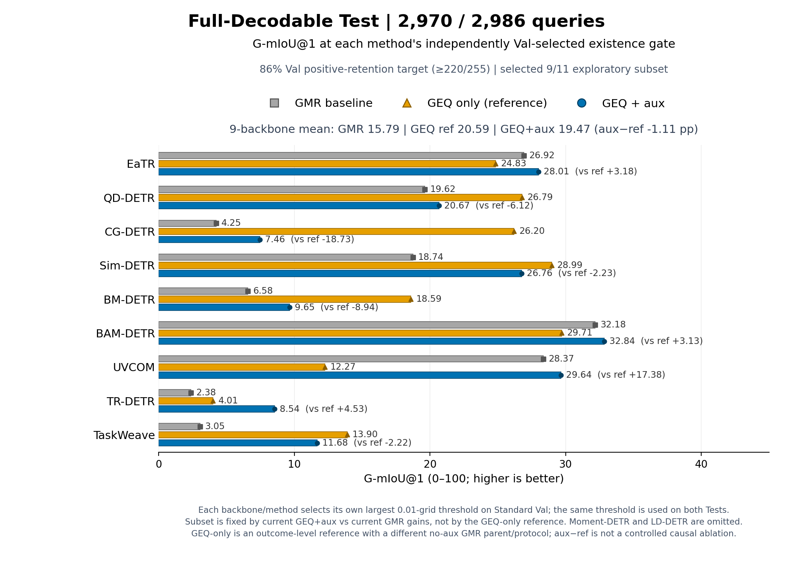
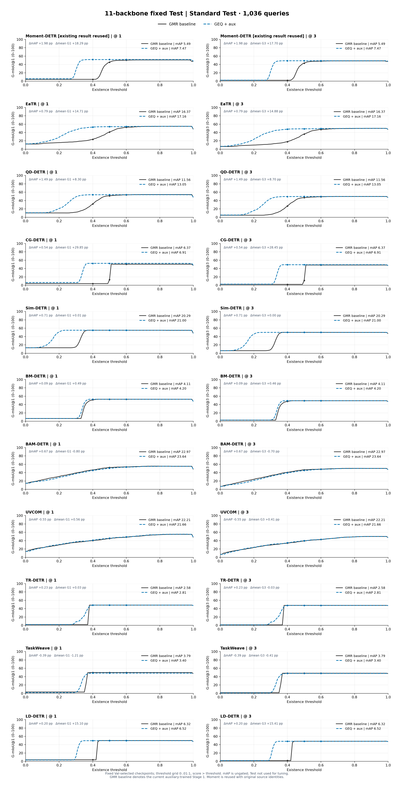
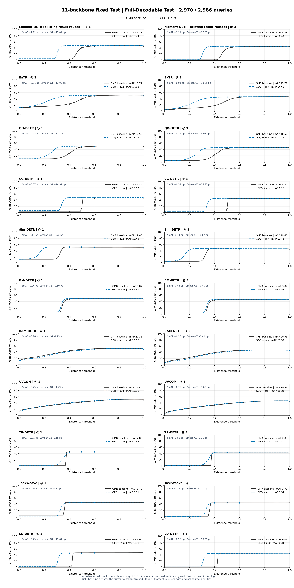
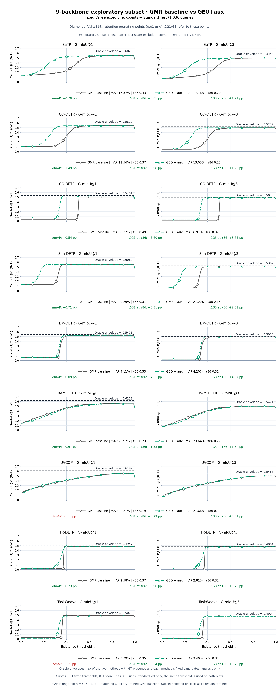
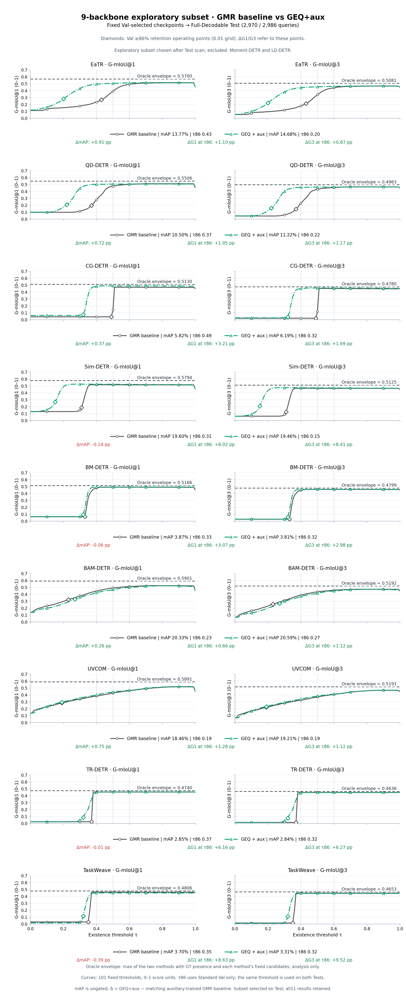
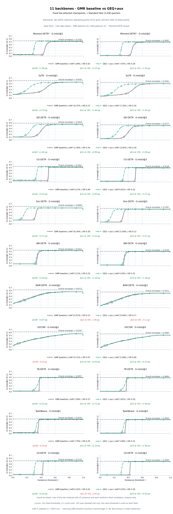
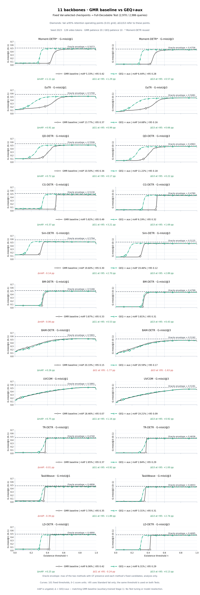

# GMR baseline → GEQ+aux：11骨干实验

本分支研究：**查询相关的逐 clip 辅助监督，能否配合 GEQ 改善广义时刻检索的定位与事件存在性判断。** 当前方法采用“两阶段均保留辅助监督”的训练方案，已完成11个骨干的 Standard / Full Test 评测。

主要观察：相对各自的 GMR baseline，GEQ+aux 在 Standard / Full 上分别有 **9/11、7/11** 个骨干的 mAP 提高，**9/11、8/11** 个骨干的 G1 提高；存在下降结果。Moment-DETR 的同起点对照表明，在 GEQ 中继续加入 aux 提高了 mAP，但 G1 略降。

[方法与命名](#方法与命名) · [11骨干效果对比](#11骨干效果对比) · [高事件保留率](#retention-analysis) · [Moment-DETR 对照](#moment-detr同起点对照) · [复现与数据](#复现与数据) · [历史实验](docs/HISTORICAL_EXPERIMENTS.md)

## 方法与命名

本轮主图比较同一骨干的两个阶段：

| 图表名称 | 模型与训练方式 | 推理时的存在性判断 |
|---|---|---|
| **GMR baseline** | Stage 1：从头训练原生 GMR，并加入逐 clip 辅助监督 | 骨干原生存在性分数 |
| **GEQ+aux** | Stage 2：继承 Stage 1 的主干及辅助头，加入 GEQ 并联合微调；辅助头继续更新 | GEQ 输出的存在性分数 |

**本文的 GMR baseline 是本轮带辅助监督的 Stage 1。** 这是沿用当前图表的命名；历史无辅助 GMR 在旧结果包中另行标注。主图的两个阶段对比反映整套 GEQ 联合微调的变化，不能单独证明 aux 优于不加 aux。

### 辅助头和训练目标

Query-aware Clip Head 从视频 encoder 表示及掩码池化后的文本表示计算逐 clip 相关性。有效 clip 的标签来自 GT 时间区间；padding 不参与损失。按每个视频分别平均正区域和负区域 BCE，两个非空组各占一半；空查询只计算负区域 BCE。Dice 只对有真实事件的查询计算：

```text
L_aux    = L_balanced_BCE + 0.2 × L_Dice
Stage 1  = L_native_GMR + 0.1 × L_aux
Stage 2  = L_native_GMR + L_GEQ_BCE + 0.1 × L_aux
```

各骨干的原生定位、显著性等损失继续保留。GEQ token 先读取文本，再逐层读取视频 encoder 表示，学习事件是否存在。辅助头只提供训练监督；推理时定位候选和排序沿用原生骨干，存在性门控使用对应阶段的存在性分数。

**方法溯源：** GEQ 来自本项目[原分支算法](https://github.com/chinagalaxy2002/Improving-Target-Presence-for-Generalized-Moment-Retrieval/blob/soccergmr-standard-geq-full/docs/ALGORITHM.md)；查询相关 Clip Head 来自本项目[最初设计](docs/CLIP_RELEVANCE_ORIGINAL_DESIGN.md)；Balanced BCE + Dice 对应早期配置名 `E3`。GEQ+aux 是这些组件在本项目中的训练组合名称。源码见 [clip.py](src/soccergmr/clip.py)、[geq.py](src/soccergmr/geq.py)、[train.py](src/soccergmr/train.py)，[完整演进记录](docs/HISTORICAL_EXPERIMENTS.md)保留各阶段来源提交。

### 统一训练与选模规则

| 项目 | Stage 1：GMR baseline | Stage 2：GEQ+aux |
|---|---|---|
| 数据与 seed | Standard Train / Val，seed=2023 | 相同 |
| 输入上限 / batch size | 128 video tokens / 32 text tokens，batch=8 | 相同 |
| 学习率 | 原生主干与辅助头3e-5 | 主干1e-5，GEQ与辅助头3e-5 |
| 选 best | Standard Val 正查询 mAP | Standard Val 三阈值 G1 均值 |
| 最大轮数 / patience | 200 / 20 | 200 / 10 |
| 后续 Test | 固定 best 评测 Standard 与 Full | 相同 |

Moment-DETR 复用已完成的模型和4份 Test 结果，保留原始源码身份；其余10个骨干在同一固定源码下完成20个训练阶段与40份 Test。10个新骨干的 Val 选择全部固定后再执行正式 Test，已有实验没有重训。[完整协议](E3_ELEVEN_PROTOCOL.md) · [来源与选模证据](results/e3_eleven/provenance/)

## 11骨干效果对比

**灰色方形为 GMR baseline，蓝色圆形为 GEQ+aux；每个骨干的两条横柱给出具体分数。** 左列 mAP 衡量正查询定位，右列 G1 衡量同时包含事件查询和空查询的广义检索。数值单位均为0–100，越大越好。

本节 G1 是固定存在性阈值 **0.4 / 0.5 / 0.6** 下的 G-mIoU@1 均值；mAP 使用未门控的正查询候选。它与后文“Val 保留率≥95%”场景采用不同的阈值设置。

### Standard Test：1,036条查询

mAP 和 G1 均有9/11个骨干提高；BAM-DETR、TaskWeave 的 G1 下降。



[PDF](results/e3_eleven/STANDARD_SUMMARY.pdf) · [SVG](results/e3_eleven/STANDARD_SUMMARY.svg)

### Full-Decodable Test：2,970 / 2,986条查询

mAP 有7/11个骨干提高，G1有8/11个提高；BAM-DETR、TR-DETR、TaskWeave 的 G1 下降。两套 Test 的提升方向并不对所有骨干、所有指标一致。



[PDF](results/e3_eleven/FULL_SUMMARY.pdf) · [SVG](results/e3_eleven/FULL_SUMMARY.svg) · [两套汇总图合集](results/e3_eleven/TEST_SUMMARY_BOTH.pdf)

<details>
<summary>展开精确数值表（GMR baseline → GEQ+aux）</summary>

| 骨干 | Standard mAP | Standard G1 | Full mAP | Full G1 |
|---|---:|---:|---:|---:|
| Moment-DETR（复用） | 5.49 → 7.47 | 33.51 → 51.80 | 5.33 → 6.44 | 30.62 → 48.46 |
| EaTR | 16.37 → 17.16 | 39.12 → 53.83 | 13.77 → 14.68 | 37.35 → 50.44 |
| QD-DETR | 11.56 → 13.05 | 45.58 → 53.89 | 10.50 → 11.22 | 41.76 → 50.47 |
| CG-DETR | 6.37 → 6.91 | 22.62 → 52.47 | 5.82 → 6.19 | 21.77 → 48.69 |
| Sim-DETR | 20.29 → 21.00 | 55.19 → 55.20 | 19.60 → 19.46 | 51.64 → 52.36 |
| BM-DETR | 4.11 → 4.20 | 52.34 → 52.83 | 3.87 → 3.81 | 48.86 → 49.36 |
| BAM-DETR | 22.97 → 23.64 | 50.65 → 49.85 | 20.33 → 20.59 | 48.31 → 46.38 |
| UVCOM | 22.21 → 21.66 | 44.70 → 45.26 | 18.46 → 19.21 | 42.49 → 43.77 |
| TR-DETR | 2.58 → 2.81 | 48.45 → 48.48 | 2.85 → 2.84 | 45.30 → 45.15 |
| TaskWeave | 3.79 → 3.40 | 49.82 → 48.61 | 3.70 → 3.31 | 46.17 → 45.03 |
| LD-DETR | 6.32 → 6.52 | 34.56 → 49.66 | 6.06 → 6.31 | 32.79 → 46.40 |

</details>

[完整指标 CSV](results/e3_eleven/METRICS.csv) · [逐 tIoU 的 AP、短事件与多区间诊断](results/e3_eleven/DETAILS.json) · [汇总图数值审计](results/e3_eleven/SUMMARY_PLOT_AUDIT.json)

<details>
<summary>展开固定模型的 G-mIoU@1 / @3 完整阈值曲线</summary>

横轴是**存在性阈值**0–1、步长0.01；每张图左列 G-mIoU@1，右列 G-mIoU@3。曲线使用固定的 Val best，只用于观察阈值响应，未按 Test 曲线重选阈值或 checkpoint。





[Standard 每骨干单页 PDF](results/e3_eleven/STANDARD_TEST_BY_BACKBONE.pdf) · [Full 每骨干单页 PDF](results/e3_eleven/FULL_TEST_BY_BACKBONE.pdf) · [曲线 CSV](results/e3_eleven/CURVES.csv)

</details>

<a id="retention-analysis"></a>

## 高事件保留率场景：86%目标、9骨干探索性子集

按本轮扫描结果，本节展示 **86% Val正查询保留率目标、0.01存在性阈值网格**下，在Standard与Full的G1都提高的9个骨干：EaTR、QD-DETR、CG-DETR、Sim-DETR、BM-DETR、BAM-DETR、UVCOM、TR-DETR、TaskWeave。

**这9个骨干是在查看本轮Test扫描后选出的探索性子集**，剔除了Moment-DETR和LD-DETR。它不能用来声称全部11骨干均提高或作为独立验证。模型checkpoint仍为既有Val best；每个骨干、每种方法的阈值只在Standard Val上选，固定用于两套Test。

### Standard Test：86%目标、9骨干

每个骨干一行，左列G-mIoU@1、右列G-mIoU@3。灰色为GMR baseline，绿色为GEQ+aux；菱形为各自Val保留率≥86%的工作点。图例给出mAP和阈值，ΔG1/G3在工作点计算，单位为百分点。



[PDF](results/e3_retention_scan/selected_86/STANDARD_TEST.pdf) · [SVG](results/e3_retention_scan/selected_86/STANDARD_TEST.svg) · [每骨干单页PDF](results/e3_retention_scan/selected_86/STANDARD_BY_BACKBONE.pdf)

### Full-Decodable Test：86%目标、9骨干

Full使用与Standard相同的Val阈值。曲线纵轴为0–1，0.01对应1个百分点。黑色Oracle虚线使用GT存在性及固定候选，仅作分析参考。完整曲线不用于Test选阈值。



[PDF](results/e3_retention_scan/selected_86/FULL_TEST.pdf) · [SVG](results/e3_retention_scan/selected_86/FULL_TEST.svg) · [每骨干单页PDF](results/e3_retention_scan/selected_86/FULL_BY_BACKBONE.pdf) · [两图合集](results/e3_retention_scan/selected_86/BOTH_TESTS.pdf)

所选9骨干在两套Test的G1、G3均为正增益，mAP下降项如实保留。子集内平均值如下，**只代表选出的9骨干，不是全部11骨干平均**：

| Test | GMR baseline平均G1 | GEQ+aux平均G1 | ΔG1百分点 | ΔG3百分点 | GEQ+aux实际正查询保留率 |
|---|---:|---:|---:|---:|---:|
| Standard | 16.586 | 21.091 | +4.504 | +4.447 | 88.03% |
| Full-Decodable | 15.786 | 19.473 | +3.687 | +3.684 | 92.68% |

### 筛选依据与未纳入的两个骨干

| 未纳入骨干 | 86%下Standard ΔG1 | 86%下Full ΔG1 |
|---|---:|---:|
| Moment-DETR | +1.561 | −0.313 |
| LD-DETR | −0.053 | −0.243 |

[9骨干数值与筛选说明](results/e3_retention_scan/selected_86/README.md) · [剔除项原值](results/e3_retention_scan/selected_86/EXCLUDED.csv) · [图表审计](results/e3_retention_scan/selected_86/AUDIT.json)

### 保留率扫描与完整范围复核

对0%–100%目标以及Val的全部256种正查询数量约束扫描后，**没有统一目标能让全部11骨干在两套Test的G1均提高**。0.01网格最多同时提高9个，完整Val分数断点最多8个。86%的粗网格平均增益较大，但同目标的断点复核在Full上平均为负，不能据此声称86%在所有阈值规则下更稳健。

[完整扫描报告](results/e3_retention_scan/README.md) · [全范围扫描图](results/e3_retention_scan/TARGET_SWEEP.png) · [Standard热图](results/e3_retention_scan/STANDARD_G1_GAIN.png) · [Full热图](results/e3_retention_scan/FULL_G1_GAIN.png) · [全部11骨干逐目标CSV](results/e3_retention_scan/METRICS.csv)

<details>
<summary>展开原95%目标、全部11骨干的完整图表与结果</summary>

以下为筛选前的95%设置，保留全部11骨干及下降项；每个方法仍按Val≥95%选择各自最大0.01网格阈值。





[原95%详细报告](results/e3_high_retention/README.md) · [原两图PDF](results/e3_high_retention/BOTH_TESTS.pdf) · [95%与断点复核CSV](results/e3_high_retention/METRICS.csv)

</details>

## Moment-DETR：同起点对照

下面两种 GEQ 微调都从同一个带辅助监督的 GMR best 开始，用于区分“加入 GEQ 微调”与“GEQ阶段继续加 aux”的结果。G1仍按固定0.4/0.5/0.6三阈值均值报告。

| 模型 | Standard mAP | Full mAP | Standard G1 | Full G1 |
|---|---:|---:|---:|---:|
| GMR baseline：共同的 Stage 1 起点 | 5.49 | 5.33 | 33.51 | 30.62 |
| GEQ：Stage 2 不加 aux | 6.33 | 5.81 | 52.45 | 48.95 |
| GEQ+aux：Stage 2 继续加 aux（本轮方法） | 7.47 | 6.44 | 51.80 | 48.46 |

相对同起点、GEQ阶段不加 aux 的对照，GEQ+aux 的 Standard / Full **mAP提高1.14 / 0.63个百分点，G1下降0.65 / 0.49个百分点**。因此，当前结果支持定位 mAP 有改善，尚不支持“继续加入 aux 可同时改善存在性与定位”的结论。其余10骨干尚无这一组完整的同起点无 aux GEQ 对照，不能把它们的 Stage 1 → Stage 2 提升全部归因于 aux。

[原始对照数据与历史无辅助 GMR/GEQ 结果](results/E3_baseline_comparison/README.md)

## 复现与数据

Standard Test 共1036条；Full使用2970/2986条可解码查询。两套 Test 有185个视频ID、186个视频—文本输入重叠，不能视为独立重复验证。所有结果为单 seed，未作统计显著性或多 seed 稳定性声明。

### 从发布结果复算和绘图

本分支包含压缩预测、GT快照、指标及哈希。以下命令不需要GPU、模型权重或视频特征：

```bash
pip install -e '.[test,report]'
python scripts/plot_e3_test_summary.py
python scripts/plot_e3_test_results.py
PYTHONPATH=src python scripts/plot_e3_retention_curves.py
PYTHONPATH=src python scripts/plot_e3_selected86_curves.py
PYTHONPATH=src python scripts/report_e3_high_retention.py --verify-only
PYTHONPATH=src python scripts/verify_e3_publication.py
```

44份 Test 指标与8,888个 G1/G3 曲线点已独立复算，汇总图的88根柱及数值标注逐一对应原始 CSV。[发布核验](PUBLICATION_CHECKS.json) · [文件哈希清单](PUBLICATION_MANIFEST.json)

### 训练与固定 Test

配置见 [configs/experiments](configs/experiments)，数据布局见 [DATA.md](docs/DATA.md)。配置中的数据、特征及架构路径保留了训练机器的绝对路径，迁移时需显式修改。模型权重和特征不随仓库发布。以下以 EaTR 为例说明单个骨干的完整两阶段流程：

```bash
export PYTHONPATH="$PWD/src"
export CUBLAS_WORKSPACE_CONFIG=:4096:8
python -m soccergmr train --config configs/experiments/eatr.json \
  --stage gmr --device cuda:0 --output runs/reproduction/eatr/gmr
python -m soccergmr train --config configs/experiments/eatr.json \
  --stage geq_full --baseline runs/reproduction/eatr/gmr/best.pt \
  --device cuda:0 --output runs/reproduction/eatr/geq_full
# 全部计划中的 Val 模型固定后，再对固定 checkpoint 执行 Test；该命令评测两套 Test。
python -m soccergmr test --config configs/experiments/eatr.json \
  --checkpoint runs/reproduction/eatr/geq_full/best.pt \
  --device cuda:0 --output runs/reproduction/eatr/geq_full_test
```

Stage 1 的固定 Test 使用同一个 `test` 命令，将 `--checkpoint` 指向 `gmr/best.pt`、输出目录换为 `gmr_test`。10个新骨干的训练源码为 [`d22986a`](https://github.com/chinagalaxy2002/Improving-Target-Presence-for-Generalized-Moment-Retrieval/commit/d22986a671076e700b7c420b259009215ce5cead)，源码哈希 `7d69e39b16dc91339b3c82f3d25e4b581896397f00283ef0dbd5f025fa6cb062`；Moment-DETR保留原始来源身份。续训使用完整 `last.pt` 及原身份，不跳过源码/配置/资产校验。

<details>
<summary>展开11骨干两阶段训练曲线</summary>


[PDF](results/e3_eleven/training_val_panel.pdf) · [SVG](results/e3_eleven/training_val_panel.svg)

</details>

### 历史记录与完整结果

- [早期方法演进、来源提交及 A/B/C/D 记录](docs/HISTORICAL_EXPERIMENTS.md)
- [E1–E6：只在 GMR 阶段增加不同辅助监督](results/clip_v2/REPORT.md)
- [后续 GEQ+aux 六组微调快照](results/clip_joint_snapshot/README.md)
- [本轮11骨干完整报告](results/e3_eleven/REPORT.md)
- [历史无辅助11骨干基线：保留原协议差异](results/test_thresholds_11_backbones/README.md)
